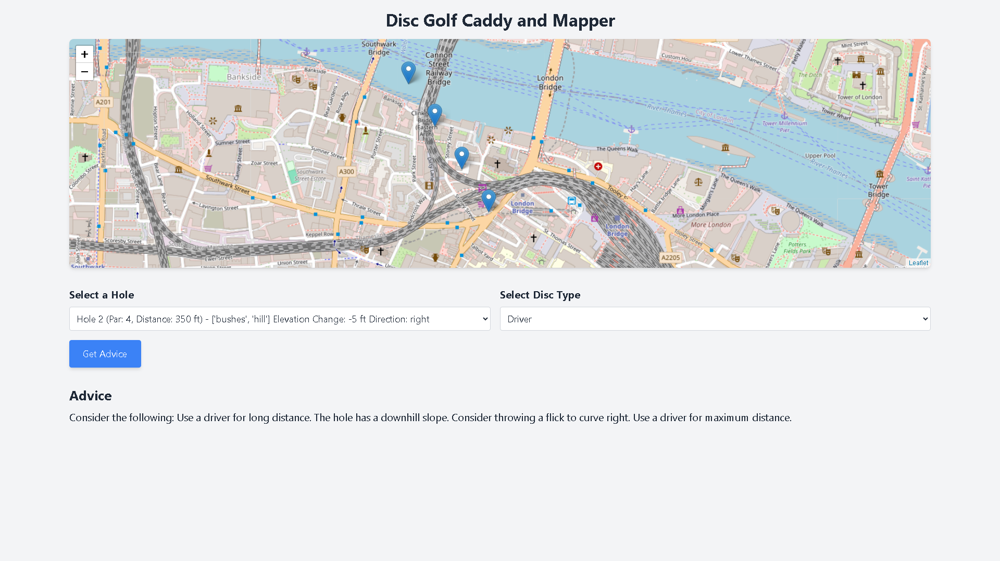

# Disc Golf Caddy and Mapper

Disc Golf Caddy and Mapper is a web application designed to assist disc golf players by providing advice on the best disc and throwing technique based on the selected hole and its characteristics. The app utilizes Flask for the backend, Tailwind CSS for styling, and JavaScript for interactivity. It also integrates Leaflet.js for mapping functionalities.

## Features

- **Interactive Map**: Visualize holes on a map with their exact locations.
- **Dynamic Advice**: Get personalized advice for each hole based on:
  - Par
  - Distance
  - Obstacles (trees, water, bushes, etc.)
  - Elevation changes (uphill, downhill)
  - Hole direction (straight, left, right)
  - Disc type (putter, mid-range, driver)
- **Responsive Design**: The app is styled using Tailwind CSS, ensuring a seamless experience across devices.
- **JSON Data Handling**: Holes and their details are dynamically loaded from a JSON file.

## How It Works

1. Select a hole from the dropdown menu.
2. Choose a disc type (putter, mid-range, or driver).
3. Click "Get Advice" to receive guidance tailored to the selected hole and disc type.

## Technologies Used

- **Backend**: Python, Flask
- **Frontend**: HTML, Tailwind CSS, JavaScript
- **Mapping**: Leaflet.js
- **Data Handling**: JSON

## Screenshots 📸

1. **Disc Golf Map**
   

   This screenshot showcases the interactive map interface with selectable holes, disc types, and personalized advice for players.

## Developed By 👨‍💻

This project is developed and maintained by [CodēCodes](https://github.com/Cod-e-Codes). 

For more projects and details, visit the developer's portfolio: [CodēCodes Portfolio](https://www.cod-e-codes.com)